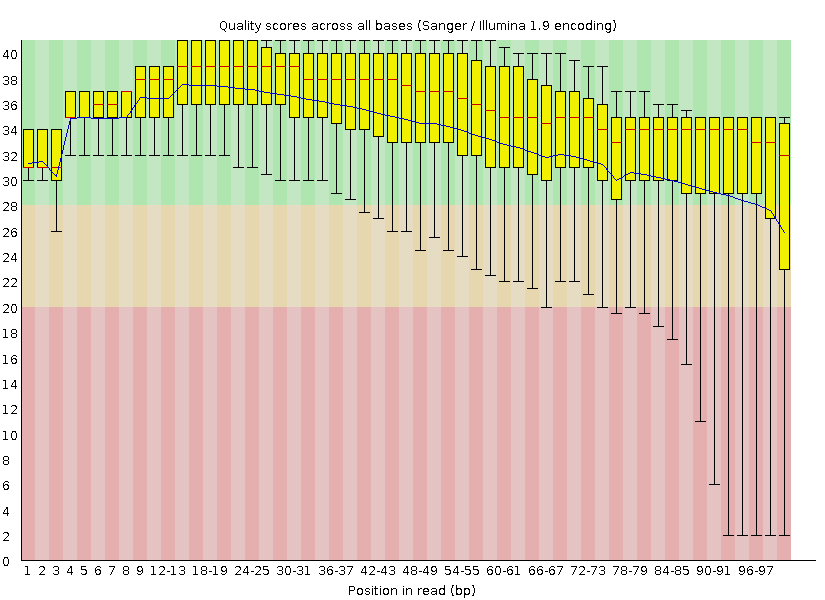

---

\newpage

# Achtergrond
## Inleiding
Een tekort aan ijzer kan de gewasopbrengst sterk beïnvloeden. Daarnaast speelt ijzer een belangrijke rol in het metabolisme en is het nodig voor plantengroei. IJzer fungeert onder andere als cofactor van veel enzymen. Verder is het betrokken bij de elektronentransportketen en fotosynthese. In eerdere onderzoeken is al onderzoek gedaan naar ijzertekorten in verschillende planten, echter is het achterliggend moleculaire mechanisme betreffende ijzertekorten niet bekend voor tarwe. Met behulp van RNA-seq zal getracht worden dit mechanisme te ontrafelen. [(Wang et al., 2020)](https://www.ncbi.nlm.nih.gov/pmc/articles/PMC7550799/)

De gebruikte cultivar is Triticum aestivum cv. Bobwhite S26 s. Zaden werden in gelijke omstandigheden gekiemd met voldoende ijzer aanwezig. Na 7 dagen werd de helft van de zaden overgebracht naar een ijzerarme omgeving. Vervolgens werden de planten gegroeid gedurende 90 dagen. Vervolgens werden van de wortels en bladeren van de planten in de twee condities RNA geïsoleerd. Per sample werden drie biologische replicaten genomen. Na een zuiveringsstap werden de sequencing libraries gemaakt. Na de library preparation werden de samples met behulp van de Illumina HiSeq gesequenced. In totaal werden 12 samples gesequenced. [(Wang et al., 2020)](https://www.ncbi.nlm.nih.gov/pmc/articles/PMC7550799/)

Na de transcriptoom analyse is gebleken dat 5969 genen differentieel tot expressie kwamen in bladeren. In de wortels kwamen minder genen differentieel tot expressie tussen de controle en behandelgroep, namelijk 2591. In figuur 1 zijn de hoeveelheden DEG’s in samples samengevat. Een Gene ontology (GO) enrichment analysis is uitegevoerd op de data om inzicht te krijgen welke pathways in respons op ijzertekort verhoogd of verlaagd worden. Uit de resultaten is gebleken dat verschillende genfamilies, MFS, ABC transmporters, OPT en NRAMP, differentieel gereguleerd werden. [(Wang et al., 2020)](https://www.ncbi.nlm.nih.gov/pmc/articles/PMC7550799/)

## Methoden
De reads in het artikel die zijn verkregen door RNA-seq zijn voor verdere verwerking gecontroleerd met FastQC, getrimmd met Trimmomatic en gemapt tegen het genoom doormiddel van Star. Om iets over genexpressie te kunnen zeggen is een kwantificatie gedaan in R met de functie featureCounts van het package Rsubread. De functie featureCounts wordt gebruikt voor een telling van reads die zijn gegenereerd op basis van RNA of DNA-sequencing. Het voordeel is dat het een snelle methode is en weinig computergeheugen vereist. Omdat het genoom van gewone tarwe hexaploid is het nodig om ook de subgenomen te identificeren, hiervoor is HomeoRoq gebruikt. Om een differentiële genexpressie uit te voeren is de functie DESeq2 nodig in R. Dit is een functie die verpakt is in het pakket van Bioconducter. Met de functie DESeq2 worden onbewerkte tellingen aan een NB-model toegekend, daar worden ook statistische test voor differentieel tot expressie gebrachte genen uitgevoerd. In deze stap wordt dus bepaald of de gemiddelde expressieniveaus van verschillende steekproefgroepen significant verschillen. Voor de GO-verrijkings analyse die ook is uitgevoerd in R is gebruik gemaakt van het R-pakket “TopGo”. Om de significante GO-termen te berekenen is een gekeken naar de WeightFisher-algoritme. Na alle voorgaande stappen zijn de resultaten gevisualiseerd met ggplot en ggnetwork. Hierin kunnen grafieken en plots gemaakt worden ter visuele assistentie van de theoretische informatie. Daarnaast zijn ook visualisaties gemaakt met VennDiagram en Pheatmap., met deze functies kan met Venndiagrammen maken en headmaps. [(Wang et al., 2020)](https://www.ncbi.nlm.nih.gov/pmc/articles/PMC7550799/)

## Data
De dataset van het artikel is opgeslagen in de [GEO database](https://www.ncbi.nlm.nih.gov/geo/query/acc.cgi?acc=GSE162027) op NCBI in de vorm van een Excel bestand. Dit Excel bestand is opgedeeld in twee onderdelen, de twee onderdelen bestaand uit samples van de wortelen en samples van de bladeren. Van elk onderdeel zijn zes samples, drie controle samples en drie samples met een laag ijzergehalte. De dataset is zo opgebouwd dat in de eerste kolom de reads zijn weergegeven. Deze zijn te herkennen aan de TreasCS naam. In de kolommen 2 tot en met 7 staat de ruwe data van de samples weergeven in de vorm van counts. Naast de ruwe data zijn in de kolommen 8 tot en met 23 nog extra data te vinden. Hierin zijn bijvoorbeeld log2 Foldchanges al weergegeven, Wald Test p-waarden en adjusted p-waarden te vinden, functie omschrijving van de genen en de locatie in de PFAM, GO en Interpro databases.

\newpage

# Analyse

## Op basis van count matrix
### Data
De data die verkregen is voor dit onderzoek is verkregen uit de NCBI GEO database. Omdat de data niet alle raw gene counts bevatte is actie ondernomen. Met de nieuwe verkregen dataset van de onderzoekers waarin wel alle raw gene counts aanwezig waren is verdere analyse uitgevoerd. Het format van de data is een csv-file. De data ziet er als volgt uit:

```{r, message=FALSE, echo=FALSE}
rawdata <- read.table(file = "data/raw_counts.csv", sep = ",", header = TRUE)
rawdata[2:13] <- lapply(rawdata[2:13], as.numeric)
knitr::kable(head(rawdata[,c(1,2,5,8,11)], caption = "De eerste zes regels van een pileup output."))
```

De data is verdeeld in 14 kolommen. In de eerste kolom wordt de gene name weergegeven zoals deze in EnsemblPlants database beschreven staat. In de daarop volgende kolommen staan de samples beschreven met de bijbehorende counts per gene name. Er is gebruik gemaakt van 4 samples, elke sample bevat 3 replicaten. De samples die vergeleken gaan worden op basis van DEG's zijn: Leaf_Fe, Leaf_control en Root_Fe en Root_control. In elke rij staat voor elke gene name het aantal getelde reads per sample.

---

## Op basis van fastq

### Data
Voor de analyse zijn een aantal bestanden met relevante data. Een referentiegenoom van tarwe is beschikbaar via deze [**site**](https://www.wheatgenome.org/Tools-and-Resources/IWGSC-RefSeq-v2.1-Assembly-and-Annotation-now-freely-available-at-URGI-and-NCBI). Een annotatie bestand in ggf3 formaat is te vinden op deze [**webstite**](https://urgi.versailles.inrae.fr/download/iwgsc/IWGSC_RefSeq_Annotations/v2.1/), daarbij is gekozen voor het `iwgsc_refseqv2.1_gene_annotation_200916.zip` bestand. Vervolgens is het volgende bestanden opgeslagen: `iwgsc_refseqv2.1_annotation_200916_HC.gff3`. Ten derde zijn de data afkomstig van de sequencer nodig. De accession code voor het BioProject op de NCBI website is **PRJNA680330**, vanaf hier zijn links te vinden naar de 12 SRA pagina's van het onderzoek. 

### Stap 1: SRA bestanden downloaden
De eerste stap in de analyse is het downloaden van de `.fastq` bestanden van SRA. De volgende 12 samples moeten gedownload worden:

* SRR13114670
* SRR13114671
* SRR13114672
* SRR13114673
* SRR13114674
* SRR13114675
* SRR13114676
* SRR13114677
* SRR13114678
* SRR13114679
* SRR13114680
* SRR13114681

Met het onderstaande commando wordt de data van één sample gedownload. Dit resulteert in twee `.fastq` bestanden, één met de forward reads en één met de reverse reads.

```{bash, eval=FALSE}
fasterq-dump SRR13114670
```

### Stap 2: QC
Op de `.fastq` bestanden wordt als eerste een kwaliteitscontrole uitgevoerd worden, hiervoor wordt gebruik gemaakt van FASTQC. In figuur 1 is het resultaat van een kwaliteitscontrole op de forward reads van de ruwe data van sample Roots_Low Fe_1 te zien. In de figuur is te zien dat er zich veel spreiding in de kwaliteit van de data aanwezig is. Daar kan voor gecorrigeerd in de volgende stap: trimmen en filteren.

{width=75%}

### Stap 3: trimmen & filteren
Met behulp van Trimmomatic (v0.39) zijn de adaptersequenties getrimd en is er gefilterd op reads met een minimale lengte van 36. Het onderstaande commando is gebruikt om de reads van sample SRR13114670 te trimmen en filteren.

```{bash, eval=FALSE}
java -jar ../../Trimmomatic-0.39/trimmomatic-0.39.jar PE 
  ../../raw_data/sample_SRR13114670/SRR13114670_1.fastq 
  ../../raw_data/sample_SRR13114670/SRR13114670_1.fastq 
  trimmed_SRR13114670_1_p.fastq trimmed_SRR13114670_1_u.fastq     
  trimmed_SRR13114670_2_p.fastq trimmed_SRR13114670_2_u.fastq 
  ILLUMINACLIP:TruSeq3-PE.fa:2:30:1 SLIDINGWINDOW:4:20 AVGQUAL:20 MINLEN:36
```

Het resultaat hiervan zijn vier `.fastq` files. 

### Stap 4: genoom indexeren met STAR
Het referentiegenoom van tarwe is met het volgende commando gedownload

```{bash, eval=FALSE}
wget "https://urgi.versailles.inrae.fr/download/iwgsc/IWGSC_RefSeq_Assemblies/v2.1//iwgsc_refseqv2.1_assembly.fa.zip"
```

https://physiology.med.cornell.edu/faculty/skrabanek/lab/angsd/lecture_notes/STARmanual.pdf
```{bash, eval=FALSE}
STAR --runThreadN 80 \
--runMode genomeGenerate \
--genomeDir wheat_genome/genome_indices \
--genomeFastaFiles wheat_genome/iwgsc_refseqv2.1_assembly.fa\
--sjdbGTFfile iwgsc_refseqv2.1_annotation_200916_HC.gff3 \
--sjdbOverhang 100
--sjdbGTFtagExonParentTranscript Parent

```

### Stap 5: reads mappen tegen genoom met STAR

```{bash, eval=FALSE}
STAR --genomeDir ... \
     --readFilesIn resources/A549_0_1chr10_1.fastq.gz resources/A549_0_1chr10_2.fastq.gz \
     --runThreadN 80
```

### Stap 6: featureCounts
https://hbctraining.github.io/Intro-to-rnaseq-hpc-O2/lessons/05_counting_reads.html
