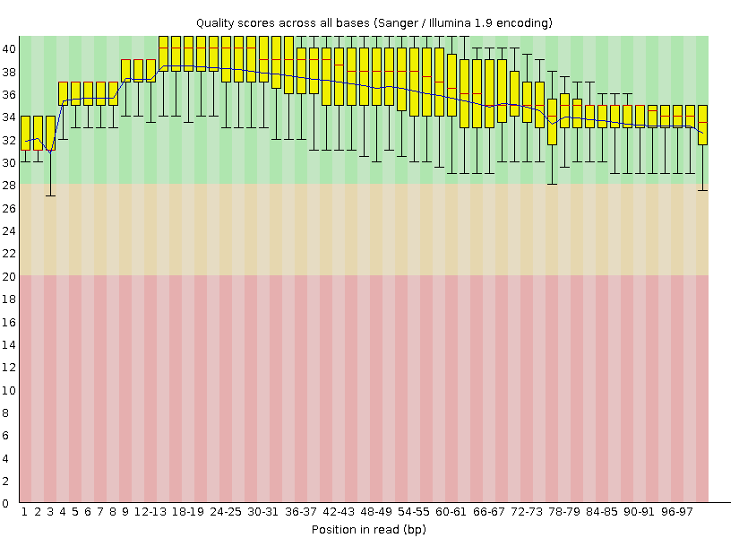

---

```{r echo=F}
knitr::opts_chunk$set(cache = T)
```

\newpage

# Achtergrond
## Inleiding
Een tekort aan ijzer kan de gewasopbrengst sterk beïnvloeden. Daarnaast speelt ijzer een belangrijke rol in het metabolisme en is het nodig voor plantengroei. IJzer fungeert onder andere als cofactor van veel enzymen. Verder is het betrokken bij de elektronentransportketen en fotosynthese. In eerdere onderzoeken is al onderzoek gedaan naar ijzertekorten in verschillende planten, echter is het achterliggend moleculaire mechanisme betreffende ijzertekorten niet bekend voor tarwe. Met behulp van RNA-seq zal getracht worden dit mechanisme te ontrafelen. [(Wang et al., 2020)](https://www.ncbi.nlm.nih.gov/pmc/articles/PMC7550799/)

De gebruikte cultivar is Triticum aestivum cv. Bobwhite S26 s. Zaden werden in gelijke omstandigheden gekiemd met voldoende ijzer aanwezig. Na 7 dagen werd de helft van de zaden overgebracht naar een ijzerarme omgeving. Vervolgens werden de planten gegroeid gedurende 90 dagen. Vervolgens werden van de wortels en bladeren van de planten in de twee condities RNA geïsoleerd. Per sample werden drie biologische replicaten genomen. Na een zuiveringsstap werden de sequencing libraries gemaakt. Na de library preparation werden de samples met behulp van de Illumina HiSeq gesequenced. In totaal werden 12 samples gesequenced. [(Wang et al., 2020)](https://www.ncbi.nlm.nih.gov/pmc/articles/PMC7550799/)

Na de transcriptoom analyse is gebleken dat 5969 genen differentieel tot expressie kwamen in bladeren. In de wortels kwamen minder genen differentieel tot expressie tussen de controle en behandelgroep, namelijk 2591. In figuur 1 zijn de hoeveelheden DEG’s in samples samengevat. Een Gene ontology (GO) enrichment analysis is uitegevoerd op de data om inzicht te krijgen welke pathways in respons op ijzertekort verhoogd of verlaagd worden. Uit de resultaten is gebleken dat verschillende genfamilies, MFS, ABC transmporters, OPT en NRAMP, differentieel gereguleerd werden. [(Wang et al., 2020)](https://www.ncbi.nlm.nih.gov/pmc/articles/PMC7550799/)

## Methoden
De reads in het artikel die zijn verkregen door RNA-seq zijn voor verdere verwerking gecontroleerd met FastQC, getrimmd met Trimmomatic en gemapt tegen het genoom doormiddel van Star. Om iets over genexpressie te kunnen zeggen is een kwantificatie gedaan in R met de functie featureCounts van het package Rsubread. De functie featureCounts wordt gebruikt voor een telling van reads die zijn gegenereerd op basis van RNA of DNA-sequencing. Het voordeel is dat het een snelle methode is en weinig computergeheugen vereist. Omdat het genoom van gewone tarwe hexaploid is het nodig om ook de subgenomen te identificeren, hiervoor is HomeoRoq gebruikt. Om een differentiële genexpressie uit te voeren is de functie DESeq2 nodig in R. Dit is een functie die verpakt is in het pakket van Bioconducter. Met de functie DESeq2 worden onbewerkte tellingen aan een NB-model toegekend, daar worden ook statistische test voor differentieel tot expressie gebrachte genen uitgevoerd. In deze stap wordt dus bepaald of de gemiddelde expressieniveaus van verschillende steekproefgroepen significant verschillen. Voor de GO-verrijkings analyse die ook is uitgevoerd in R is gebruik gemaakt van het R-pakket “TopGo”. Om de significante GO-termen te berekenen is een gekeken naar de WeightFisher-algoritme. Na alle voorgaande stappen zijn de resultaten gevisualiseerd met ggplot en ggnetwork. Hierin kunnen grafieken en plots gemaakt worden ter visuele assistentie van de theoretische informatie. Daarnaast zijn ook visualisaties gemaakt met VennDiagram en Pheatmap., met deze functies kan met Venndiagrammen maken en headmaps. [(Wang et al., 2020)](https://www.ncbi.nlm.nih.gov/pmc/articles/PMC7550799/)

## Data
De dataset van het artikel is opgeslagen in de [GEO database](https://www.ncbi.nlm.nih.gov/geo/query/acc.cgi?acc=GSE162027) op NCBI in de vorm van een Excel bestand. Dit Excel bestand is opgedeeld in twee onderdelen, de twee onderdelen bestaand uit samples van de wortelen en samples van de bladeren. Van elk onderdeel zijn zes samples, drie controle samples en drie samples met een laag ijzergehalte. De dataset is zo opgebouwd dat in de eerste kolom de reads zijn weergegeven. Deze zijn te herkennen aan de TreasCS naam. In de kolommen 2 tot en met 7 staat de ruwe data van de samples weergeven in de vorm van counts. Naast de ruwe data zijn in de kolommen 8 tot en met 23 nog extra data te vinden. Hierin zijn bijvoorbeeld log2 Foldchanges al weergegeven, Wald Test p-waarden en adjusted p-waarden te vinden, functie omschrijving van de genen en de locatie in de PFAM, GO en Interpro databases.

\newpage

# Analyse

## Op basis van count matrix
### Data
De data die verkregen is voor dit onderzoek is verkregen uit de NCBI GEO database. Omdat de data niet alle raw gene counts bevatte is actie ondernomen. Met de nieuwe verkregen dataset van de onderzoekers waarin wel alle raw gene counts aanwezig waren is verdere analyse uitgevoerd. Het format van de data is een csv-file. De data kan ingeladen worden met de volgende formule en ziet er dan als volgt uit:

```{r echo=T, results='markup'}
# Load data and make it numeric.
rawdata <- read.table(file = "data/raw_counts.csv", sep = ",", header = TRUE)
rawdata[2:13] <- lapply(rawdata[2:13], as.numeric)
row.names(rawdata) <- rawdata$Gene
# Make a table.
knitr::kable(head(rawdata[,c(1,2,5,8,11)], caption = 
                    "De eerste zes regels van de CSV file met 
                     de raw count data."))
```

De data is verdeeld in 14 kolommen. In de eerste kolom wordt de gene name weergegeven zoals deze in EnsemblPlants database beschreven staat. In de daarop volgende kolommen staan de samples beschreven met de bijbehorende counts per gene name. Er is gebruik gemaakt van 4 samples, elke sample bevat 3 replicaten. De samples die vergeleken gaan worden op basis van DEG's zijn: Leaf_Fe, Leaf_control en Root_Fe en Root_control. In elke rij staat voor elke gene name het aantal getelde reads per sample.

### Exploratory Data Analysis
#### Boxplot
Om verder onderzoek te kunnen doen moet eerst de ruwe data geanalyseerd en gevisualiseerd worden. Een veel gebruikte plot om naar de verschillen in aantallen te kijken is de boxplot. De boxplot werkt doormiddel van boxen en is een weergave van een dataset waarbij een minimum, eerste kwartiel, mediaan, derde kwartiel en een maximum worden weergegeven. Daarnaast worden de uitschieters als bolletjes aangeduid. Voor de gebruikte dataset is een boxplot gemaakt. De counts zijn eerst omgezet naar de log2 van de counts, dit is gedaan omdat het nummerieke bereik van de counts erg groot kan zijn. De gecreëerde boxplot wordt hieronder weergegeven:

```{r echo=T, results='hide'}
# Load packages.
library(tidyr)
library(ggplot2)
# Calculate log2 of the data and transform it to a pivot_longer format.
rawdata_log2 <- cbind(log2(rawdata[,2:13] + 1), rawdata[,1])
transformed_raw_data <- pivot_longer(rawdata_log2, cols = 1:12, names_to = "sample", values_to = "log2_value")
# Plot the data to a boxplot.
ggplot(transformed_raw_data, aes(x = sample, y = log2_value))+ 
  geom_boxplot(fill = "steelblue") + 
  theme_light() + 
  theme(axis.text.x = element_text(angle  = 45, hjust = 1)) + 
  labs(x = "Sample", y = "log2(counts)")
```

In de box wordt voor elk sample de mediaan weergegeven. Dit is de dikke zwarte lijn die in elke box te zien is. Het minimum is bij elk sample 0. Dit is te verklaren omdat niet tegen elke gene name een count is gemapt. Het eerste kwartiel is het begin van de box bij 0 en het derde kwartiel wordt weergegeven als het einde van de box. Het maximum wordt weergeven door de dunne lijn die vanuit de box omhoog gaat. Boven het maximum zijn de uitschieters weergegeven, deze zijn weergegeven als bolletjes.

Wat opvalt aan de data is dat de Leaf_Control samples een gelijke mediaan hebben. Daarnaast heeft deze groep wel de meeste uitschieters. De andere drie groepen laten bij de samples een afnemend box niveau zien, er zijn geen grootte verschillen waarneembaar. Op dit gebied is dan ook besloten om geen samples weg te laten in het verdere onderzoek.

#### Density plot

Een Density plot wordt ook gebruikt om foutieve of afwijkende samples op te sporen. De log2 per sample wordt uitgezet tegen de density. Hoogte van de pieken is niet van belang, wat wel van belang is zijn de verschillende pieken. Wanneer een bepaald sample andere pieken vertoond dan de rest van de samples kan dit duiden op een foutief of afwijkend sample. In onderstaande density plot zijn de 12 samples uit het onderzoek zichtbaar met het bijbehorende piekenpatroon. Ook is de code weergegeven waarop de density plot gebasseerd is.

```{r echo=T, results='hide', message=FALSE}
# Load packages.
library(scales)
library(affy)
# Make a color group.
myColors <- hue_pal()(4)
# Plot the data to a density plot.
plotDensity(log2(rawdata[,-1] + 0.1), col=rep(myColors, each=3),
            lty=c(1:ncol(rawdata[,-1])), xlab='Log2(count) of the raw data',
            ylab = 'Density', main='Density plot')
# Make a legend.
legend('topright', names(rawdata[,-1]), lty=c(1:ncol(rawdata[,-1])),
       col=rep(myColors, each=3))
```

De samples worden weergegeven doormiddel van verschillende kleuren lijnen. Rond de -3 is de grootste piek zichtbaar. Omdat met een log2 wordt gewerkt krijgen alle genen waar geen counts tegen gemapt zijn een score van -3. Te zien is in deze density plot is dat alle lijnen netjes op elkaar liggen, dit betekent dat er geen afwijkingen gevonden zijn. Dit resultaat komt overeen met de resultaten in de boxplot.

#### Barplot

Voor het weergeven van een het aantal counts kan men een tabel maken. Een tabel is minder goed te interpreteren als een barplot, daarom is besloten een barplot te maken waarbij de samples uitgezet zijn tegen het totaal aantal counts * 1e6. Door de barplot kan is in een oogopslag te zijn tegen welk sample veel counts zijn gevonden en of dit overeenkomt met de samples binnen en buiten de zelfde groep. Hieronder is de R code weergegeven waarmee onderstaande barplot is gemaakt. 

```{r echo=T, results='hide'}
# Calculate the sum of the counts for each sample.
col_sums <- as.data.frame(apply(rawdata[2:13], 2, sum))
col_sums$group <- row.names(col_sums)
rownames(col_sums) <- 1:12
colnames(col_sums) <- c("sum", "group")
# Plot the data to a barplot
ggplot(col_sums, aes(x = group, y = sum/1e6)) + 
  geom_bar(stat = "identity", fill = "steelblue") + 
  theme_light() + 
  theme(axis.text.x = element_text(angle  = 45, hjust = 1)) + 
  labs(x = "Sample", y = "Total read count in millions")
```

In de barplot zijn de verschillen duidelijk zichtbaar tussen de verschillende samples onderling maar ook per groep. De samples in de Leaf_Control groep hebben de minste verschillen in total read count in millions, dit komt ook overeen met de verschillen in de boxen van de boxplot. Daarnaast is het zelfde patroon (aflopende trap) zichtbaar bij de Leaf_Fe, Root_Control en Root_Fe. Bij deze drie laatste groepen valt vooral het verschil tussen het eerste sample en het derde sample per groep op. Hier zit een verschil in van ongeveer 33% per groep.

#### Heatmap

Met een heatmap kan gekeken worden of bepaalde data verschilt ten opzichte van dezelfde groep, controle groep of juist een geheel andere groep die in het onderzoek wordt meegenomen. In dit onderzoek wordt de Leaf_Control met de Leaf_Fe vergeleken en de Root_Control met de Root_Fe. Een visualisatie waarmee dit duidelijk kan worden is een heatmap. Een heatmap is een grafische weergave, aan de hand van kleuren kan men zien welke samples het meest op elkaar lijken. Ook voor dit onderzoek is een heatmap gemaakt. Alvorens een heatmap gemaakt kan worden moet eerst de data in een matrix gezet worden. Dit kan met het een onderdeel van DESeq2, deze functie heet: DESeqDataSetFromMatrix. Hierna moet nog een een eenvoudige normalisatie gedaan worden met VST. VST staat voor VarianceStabilizingTransformation en berekend een variant stabiliserende transformatie uit de relatie tussen het gemiddelde en de spreiding. Ook voor de grootte van de dataset wordt gecorrigeerd. Om de data dan nog in een bepaald format te plaatsen is een annotatieframe nodig. In dit annotatieframe wordt aangegeven welke groepen en samples er zijn. Dit is een simpel frame waarin de kolomnamen van de ruwe data zijn gebruikt. Daarnaast is nog uitgesplitst om welke groep het gaat. De R code en de bijhorende heatmap zijn hieronder weergegeven: 

```{r echo=T, results='hide', message=FALSE}
# Load libraries
library(DESeq2)
library(pheatmap)
# Make a DESeqDataSetFromMatrix
rawdata <- rawdata[-1]
ddsMat <- DESeqDataSetFromMatrix(countData = rawdata,
                                 colData = data.frame(samples = names(rawdata)),
                                 design = ~ 1)
# Normalisation with vst
rld.dds <- vst(ddsMat)
rld <- assay(rld.dds)
sampledists <- dist( t( rld ))
sampleDistMatrix <- as.matrix(sampledists)
# Make a annotation frame
annotation <- data.frame(Treatment = factor(rep(rep(1:2, each = 3), 2),
                                          labels = c("Fe", "Control")),
                         Tissue = factor(rep(1:2, each = 6), 
                                         labels = c("Leaf", "Root")))
# Connect the annotion frame with the names of the rawdata file
rownames(annotation) <- colnames(rawdata)
# Plot the data to a pheatmap
pheatmap(sampleDistMatrix, show_colnames = FALSE,
         annotation_col = annotation,
         clustering_distance_rows = sampledists,
         clustering_distance_cols = sampledists,
         main = "Heatmap")
```

In de heatmap is onderscheidt gemaakt tussen de verschillende Tissues (Leaf in het turquoise en Root in het paars) en de Treatments (Fe in het groen en Control in het lichtoranje). Om samenhang of verschil aan te tonen tussen de verschillende Tissues en Treatments is met een kleurindicatie, die aan de rechterkant van de heatmap is weergegeven, de grootte van de verschillen aangegeven. Bij een verschil van nul, dat voorkomt als hetzelfde sample wordt vergeleken, wordt het vakje donkerblauw gekleurd. De rode kleur is te verklaren omdat twee verschillende Tissue's worden vergeleken in de vakken die rood kleuren, hier is dus weinig overeenkomst. De verschillen in alleen Treatment zijn een stuk kleiner, deze vakken lichten daarom lichtblauw of lichtgelig op. 

#### MDS plot

Een andere manier om te kijken hoe de samples geclusterd zijn is door middel van een MDS plot. De verwachting is dat de samples zich bij de juiste groep voegen. MDS staat voor Multi-Dimensional Scaling. De werking van MDS is op basis van de ongelijkheidsmaat tussen de samples, de ongelijkheidsmaat is ook wel de afstand. De afstand ten opzichte van elkaar wordt vastgesteld wanneer de samples in een plot geplaatst worden. De voorwaarden voor een MDS zijn: afstanden zijn nooit negatief, de afstand naar zichzelf is altijd 0 en het gebruik van twee diminsesies. De afstanden worden bepaald met de Poisson verdeling. Dit is de standaardwijking (de wortel uit het gemiddelde). Hoe groter de labda hoe groter het gemiddelde. Voor dit onderzoek is een MDS plot gemaakt, die hieronder wordt weergegeven met daarboven de gebruikte R code. 

```{r echo=T, results='hide', message=FALSE}
# Load package.
library(PoiClaClu)
# Calculate the Poisson distance and make a matrix.
dds <- assay(ddsMat)
poisd <- PoissonDistance( t(dds) )
samplePoisDistMatrix <- as.matrix(poisd$dd)
mdsPoisData <- data.frame( cmdscale(samplePoisDistMatrix) )
# Group the samples.
groups <- factor(rep(1:4, each=3), 
                 labels = c("leaf_treatment", "leaf_control", "root_treatment", "root_control"))
# Make names for the mdsPoisData frame.
names(mdsPoisData) <- c('x_coord', 'y_coord')
# Make a legend.
Legend <- factor(rep(1:4, each=3), 
                 labels = c("Leaf_Fe", "Leaf_control", "Root_Fe", 
                            "Root_control"))
coldata <- colnames(rawdata)
# Plot the data to a MDS plot.
ggplot(mdsPoisData, aes(x_coord, y_coord, color = groups, label = coldata)) + 
  geom_text(size = 4) +
  ggtitle('Multi Dimensional Scaling') +
  labs(x = "Poisson Distance", y = "Poisson Distance") +
  theme_light()
```

De MDS plot laat duidelijk de scheiding tussen de verschillende groepen zien. Wanneer men verticaal scheidt worden de groepen verdeelt in Leaf en Root waarbij de samples van de controle en treatment groep zich clusteren. Wanneer men horizontaal scheidt worden de groepen verdeelt in treatment en controle. Deze clustering verloopt dus precies zoals verwacht. Wel is te zien dat de de Leaf_Fe_3 een afwijking heeft ten opzichte van Le_Fe_1 en Leaf_Fe_2. De Leaf_Control groep laat een exacte clustering zien. De samples van Root_Control en de Root_Fe groepen liggen wel iets verspreidt maar zijn nog steeds geclusterd.

### Discovering Differentialy Expressed Genes
#### DESeq2

Het DESeq2-pakket is ontworpen voor normalisatie, visualisatie en differentiële analyse van hoogdimensionale telgegevens. Het maakt gebruik van een soort kansberekening, die de Bayes techniek wordt genoemd. Dit om te schatten wat de effecten zijn voor log fold
change en verspreiding. Een package die al deze functies kan uitoefenen is DESeq2. DESeq2 doet schattingen op het gebied variantie-gemiddelde, afhankelijkheid in telgegevens van high-throughput sequencing-assays en test op differentiële expressie op basis van een model zelf aangegeven model.

```{r echo=T, results='hide', message=FALSE}
condition <- as.factor(paste(annotation$Tissue, annotation$Treatment, 
                             sep = "_"))
dds <- DESeqDataSetFromMatrix(countData = rawdata,
                              colData = data.frame(condition=condition),
                              design = ~ 0+condition)
results_dds <- DESeq(dds)

resultsNames(results_dds)
res <- results(results_dds, contrast = c("condition", "Leaf_Fe", 
                                         "Leaf_Control"))
res1 <- results(results_dds, contrast = c("condition", "Root_Fe", 
                                          "Root_Control"))
```

Dankzij DESeq2 is het mogelijk om nu verder te onderzoeken wat de functie van de gevonden DEG's zijn. Het is mogelijk om verschillende visualisaties te maken. Bij voorbeeld het maken van een Volcano plot en Venn Diagram. In de verdere subkopjes worden deze visualisaties weergegeven voor de genormaliseerde dataset.

#### Volcano plot

Om visueel te kunnen weergeven welke genen het meest significant zijn en daarnaast ook nog een lage of een hoge fold change hebben, kan men gebruik maken van een volcano plot. In een volcano plot wordt onderscheid gemaakt tussen verschillende aspecten. Genen die een hoge of lage fold change hebben zullen zich meer aan de linkerkant en aan de rechterkant van de plot bevinden. Genen die niet differentieel tot expressie komen of weinig expressie tonen bevinden zich in het midden, deze genen hebben dus een lagere fold change als 1. Een ander aspect waarna gekeken wordt in een volcano plot is de adjusted p-value. De adjusted p-value is de p-value die gecorrigeerd is voor het aantal punten die berekend zijn, dit wordt ook wel multiple testing correction genoemd. Hoe hoger een punt zich in de volcano plot bevindt hoe significanter dit punt is en dus ook interessanter. De meest interessante punten in de volcano plot worden aangeduid met naam zodat men in één oogopslag kan zien welke genen biologische relevant en signifcant zijn. Voor dit vergelijkingsonderzoek zijn ook twee volcano plots gecreërd. In deze plots is gekeken welke genen in de leafs en in de roots significant zijn en daarnaast ook biologisch relevant. De R-code voor het maken van de plots is hieronder weergegeven. Hier op volgen de twee volcano plots.

```{r echo=T, results='hide', message=FALSE, warning=FALSE}
# Load packages
library(gridExtra)
library(ggrepel)
# Determine the p-value threshold and log fold change 
deseq.results <- cbind(rld, as.data.frame(res@listData))

pval_threshold <- 0.05
logfc_threshold <- 1
deseq.threshold <- as.factor(abs(deseq.results$log2FoldChange) >= 
                               logfc_threshold & deseq.results$padj < 
                               pval_threshold)
# Plot the data to a volcano plot
g = ggplot(data=deseq.results, 
           aes(x=log2FoldChange, y=-log10(padj), 
               colour=deseq.threshold)) +
  geom_point(alpha=0.4, size=1.75) +
  theme(legend.position = "none") +
  theme_bw() + theme(legend.position="none") +
  geom_vline(xintercept = logfc_threshold) +
  geom_vline(xintercept = -logfc_threshold) +
  geom_hline(yintercept = -log10(pval_threshold)) +
  xlab("fold change") + ylab("-log10 padj") +
  ggtitle("Leaf_Fe vs Leaf_Control DEGs according to DESeq2 with FDR <= 0.05
           and absolute FC >= 2") +
  theme(plot.title = element_text(size = 8)) +
  geom_text_repel(aes(label=ifelse(padj < 0.1e-6 & abs(log2FoldChange) 
                                   >= logfc_threshold, row.names(deseq.results), 
                                   '')))
# Make the data for sample 2 compatible
deseq.results1 <- cbind(rld, as.data.frame(res1@listData))
deseq.threshold1 <- as.factor(abs(deseq.results1$log2FoldChange) 
                      >= logfc_threshold & deseq.results1$padj < pval_threshold)

g1 = ggplot(data=deseq.results1, 
            aes(x=log2FoldChange, y=-log10(padj),
                colour=deseq.threshold1)) +
  geom_point(alpha=0.4, size=1.75) +
  theme(legend.position = "none") +
  theme_bw() + theme(legend.position="none") +
  geom_vline(xintercept = logfc_threshold) +
  geom_vline(xintercept = -logfc_threshold) +
  geom_hline(yintercept = -log10(pval_threshold)) +
  xlab("fold change") + ylab("-log10 padj") +
  ggtitle("Root_Fe vs Root_Control DEGs according to DESeq2 with FDR <= 0.05 
           and   absolute FC >= 2") +
  theme(plot.title = element_text(size = 8)) +
  geom_text_repel(aes(label=ifelse(padj < 0.1e-6 & abs(log2FoldChange) 
                                   >= logfc_threshold,
                                   row.names(deseq.results1), '')))

grid.arrange(g, g1, nrow = 1) 

```

In de eerste volcano plot is de Leaf_Fe vergeleken met de Leaf_Control. De gevonden DEG's die een fold change hoger hebben dan 1 en een adjusted p-value (padj) lager dan 0,05 worden als groene punten weergeven. De rode punten zijn geen DEG's en voldoen dus niet aan de eisen, de punten hebben een fold change lager als 1 of een hogere adjusted p-value dan 0,05. Deze regels gelden ook voor de twee plot waarin de Root_Fe is vergeleken met de Root_Control. De meest interessante punten zijn ook nog bij naam genoemd in de volcono plots. 

#### Venn Diagram

```{r echo=T, results='hide', message=FALSE}
DESeq.degs <- row.names(deseq.results[which(deseq.threshold == TRUE),])
DESeq.degs1 <- row.names(deseq.results1[which(deseq.threshold1 == TRUE),])

library(VennDiagram)

deg.intersect = length(intersect(DESeq.degs, DESeq.degs1))
deg.venn <- list('intersect' = deg.intersect,
                 'Leaf' = length(DESeq.degs),
                 'Root' = length(DESeq.degs1))


venn.plot <- draw.pairwise.venn(deg.venn$Leaf, deg.venn$Root, deg.venn$intersect,
                                category = c("Leaf", "Root"), scaled = F,
                                fill = c("light blue", "pink"), 
                                alpha = rep(0.5, 2), cat.pos = c(0, 0))
grid.draw(venn.plot)

```

## Op basis van fastq

### Data
Voor de analyse zijn een aantal bestanden met relevante data. Een referentiegenoom van tarwe is beschikbaar via deze [**site**](https://www.wheatgenome.org/Tools-and-Resources/IWGSC-RefSeq-v2.1-Assembly-and-Annotation-now-freely-available-at-URGI-and-NCBI). Een annotatie bestand in ggf3 formaat is te vinden op deze [**webstite**](https://urgi.versailles.inrae.fr/download/iwgsc/IWGSC_RefSeq_Annotations/v2.1/), daarbij is gekozen voor het `iwgsc_refseqv2.1_gene_annotation_200916.zip` bestand. Vervolgens is het volgende bestanden opgeslagen: `iwgsc_refseqv2.1_annotation_200916_HC.gff3`. Ten derde zijn de data afkomstig van de sequencer nodig. De accession code voor het BioProject op de NCBI website is **PRJNA680330**, vanaf hier zijn links te vinden naar de 12 SRA pagina's van het onderzoek. 

### Stap 1: SRA bestanden downloaden
De eerste stap in de analyse is het downloaden van de `.fastq` bestanden van SRA. De volgende 12 samples moeten gedownload worden:

* SRR13114670 x
* SRR13114671 x
* SRR13114672
* SRR13114673
* SRR13114674
* SRR13114675
* SRR13114676
* SRR13114677
* SRR13114678
* SRR13114679
* SRR13114680
* SRR13114681

Met het onderstaande commando wordt de data van één sample gedownload. Dit resulteert in twee `.fastq` bestanden, één met de forward reads en één met de reverse reads.

```{bash, eval=FALSE}
fasterq-dump SRR13114670
```

### Stap 2: QC
Op de `.fastq` bestanden wordt als eerste een kwaliteitscontrole uitgevoerd worden, hiervoor wordt gebruik gemaakt van FASTQC. In figuur 1 is het resultaat van een kwaliteitscontrole op de forward reads van de ruwe data van sample Roots_Low Fe_1 te zien. In de figuur is te zien dat er zich veel spreiding in de kwaliteit van de data aanwezig is. Daar kan voor gecorrigeerd in de volgende stap: trimmen en filteren.

{width=75%}

### Stap 3: trimmen & filteren
Aangezien de ruwe data niet van voldoende kwaliteit is, zulllen de reads getrimd en gefilterd worden. Daarnaast bevatten de reads nog adaptersequenties die ook verwijderd moeten worden. Voor dit proces zal gebruik gemaakt worden van Trimmomatic (v0.39). Hiermee zijn de adaptersequenties van de reads verwijderd, daarnaast zijn nog de volgende parameters meegegeven: SLIDINGWINDOW met een window van 4 en een kwaliteit van 20, een gemiddelde kwaliteit van minimaal 20 en een minimum lengte van 36 bp. Het onderstaande commando is gebruikt om de forward reads van sample Roots_Low Fe_1 te trimmen en filteren.

```{bash, eval=FALSE}
java -jar ../../Trimmomatic-0.39/trimmomatic-0.39.jar PE 
  ../../raw_data/sample_SRR13114670/SRR13114670_1.fastq 
  ../../raw_data/sample_SRR13114670/SRR13114670_1.fastq 
  trimmed_SRR13114670_1_p.fastq trimmed_SRR13114670_1_u.fastq     
  trimmed_SRR13114670_2_p.fastq trimmed_SRR13114670_2_u.fastq 
  ILLUMINACLIP:TruSeq3-PE.fa:2:30:1 SLIDINGWINDOW:4:20 AVGQUAL:20 MINLEN:36
```

Met FASTQC is nogmaals een rapport gegenereerd om de kwaliteit van de data te inspecteren. Figuur 2 laat een figuur hieruit zien. In vergelijking tot figuur 1 is de spreiding van de kwaliteit nu een stuk kleiner. Verder zijn korte reads verwijderd, wat niet zichtbaar is in deze figuur. De data is nu van voldoende kwaliteit voor de volgende stap.

{width=75%}

### Stap 4.1: genoom indexeren met STAR
Voordat reads tegen het referentiegenoom gemapt kunnen worden, moet het genoom eerst geïndexeerd worden. Aangezien STAR gebruikt wordt voor het mappen,  zal hiermee ook het indexeren uitgevoerd worden. Hiervoor is een `.fasta` bestand nodig met het referentiegenoom en een annotatie bestand. Met het onderstaande commando wordt het referentiegenoom gedownload.

```{bash, eval=FALSE}
wget "https://urgi.versailles.inrae.fr/download/iwgsc/IWGSC_RefSeq_Assemblies/v2.1/iwgsc_refseqv2.1_assembly.fa.zip"
```

Daarna kan het geïndexeerd worden met het commando hieronder. Deze indexeringsstap zal eenmaal uitgevoerd worden, waarna dit telkens overnieuw gebruikt kan worden in het mappen.

```{bash, eval=FALSE}
STAR --runThreadN 80 \
--runMode genomeGenerate \
--genomeDir wheat_genome/genome_indices \
--genomeFastaFiles wheat_genome/iwgsc_refseqv2.1_assembly.fa\
--sjdbGTFfile iwgsc_refseqv2.1_annotation_200916_HC.gff3 \
--sjdbOverhang 100 \
--sjdbGTFtagExonParentTranscript Parent
```

### Stap 4.2: reads mappen tegen genoom met STAR
Nu het genoom geïndexeerd is kunnen de reads tegen het referentiegenoom gemapt worden. Met het onderstaande commando wordt dit gedaan. Dit resulteert in een `.SAM` file, waarin 16.598.504 (72.41%) reads gemapt zijn tegen het genoom.
https://hbctraining.github.io/Intro-to-rnaseq-hpc-O2/lessons/03_alignment.html

```{bash, eval=FALSE}
STAR --genomeDir wheat_genome/genome_indices \
     --readFilesIn trimmed_data/sample_SRR13114670/test/trimmed_SRR13114670_1_p.fastq \
       trimmed_data/sample_SRR13114670/test/trimmed_SRR13114670_2_p.fastq \
     --runThreadN 80 \
     --outSAMtype BAM
```

Table: Mapping statistics

|Sample|SRA Accession|Number of input reads|Uniquely mapped reads|reads mapped to multiple loci|
|-|-|-|-|-|
|Roots_LowFe_1|SRR13114670|22,924,347|16,598,504|2,572,236|
|Roots_LowFe_2|SRR13114671|22,601,274|15,341,708|2,343,812|
|Roots_LowFe_3|SRR13114672|16,880,752|10,241,379|1,545,672|
|Roots_Control_1|SRR13114673|23,160,915|17,973,764|2,678,863|
|Roots_Control_2|SRR13114674|20,028,02|14,959,171|2,264,441|
|Roots_Control_3|SRR13114675|13,993,365|10,514,505|1,585,875|

|reads unmapped: too short|reads unmapped: other|
|-|-|
|15,27%|0,74%|
|20,68%|0,70%|
|28,96%|0,86%|
|9,76%|0,71%|
|12,79%|0,82%|
|12,85%|0,43%|

### Stap 5: featureCounts
Uit de mapping stap is een `.SAM` file verkregen. Om nu te tellen hoe vaak een read tegen een bepaald transcript gemapt is, wordt `featureCounts` gebruikt. Dit commando heeft twee bestanden nodig: een annotatie bestand en een alignment bestand in `.SAM` of `.BAM` format. Met het commando hieronder wordt een count matrix voor met één sample gemaakt. In tabel 2 zijn de eerste acht regels van de count matrix te zien.
https://hbctraining.github.io/Intro-to-rnaseq-hpc-O2/lessons/05_counting_reads.html

```{R, eval=FALSE}
#Path to the annotation file
annotation_file <- "/local-fs/bachelor-students/2020-2021/Thema12/plant_gene_expression/iwgsc_refseqv2.1_annotation_200916_HC.gff3"

#Paths to the .BAM files
bam_files <- paste0("/local-fs/bachelor-students/2020-2021/Thema12/plant_gene_expression/raw_data/sample_SRR131146", 
                    70:75, 
                    "/Aligned.sortedByCoord.out.bam")

#Run featureCounts
featureCounts_output <- featureCounts(files = bam_files, 
                                      annot.ext = annotation_file,
                                      isGTFAnnotationFile = T,
                                      GTF.featureType="mRNA",
                                      GTF.attrType = "ID",
                                      nthreads=64,
                                      isPairedEnd=TRUE)

#Save the count data in a separate dataframe and add column names
count_data <- as.data.frame(featureCounts_output$counts)
colnames(count_data) <- c("root_treatment_1", "root_treatment_2", "root_treatment_3", 
                          "root_control_1", "root_control_2", "root_control_3")

#Save the count data as a csv file
write.csv(count_data, "data/root_counts.csv")

```

### Stap 6: DESeq2
